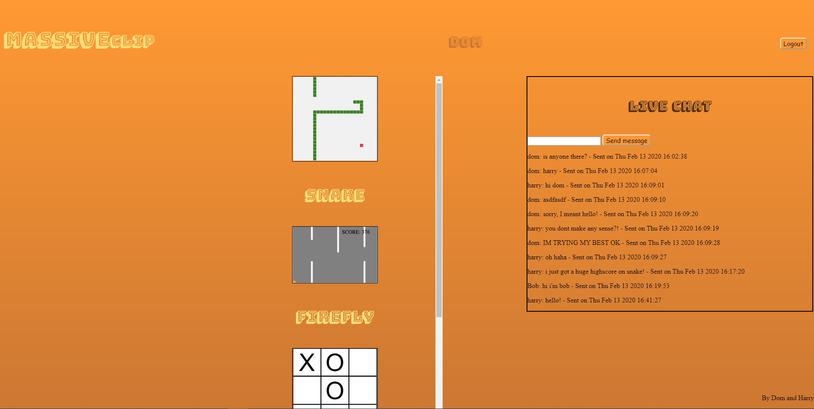
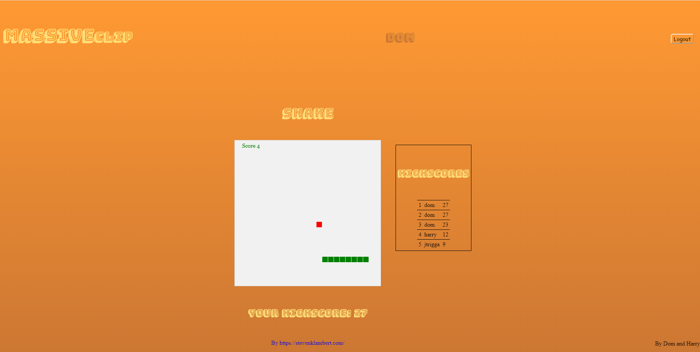
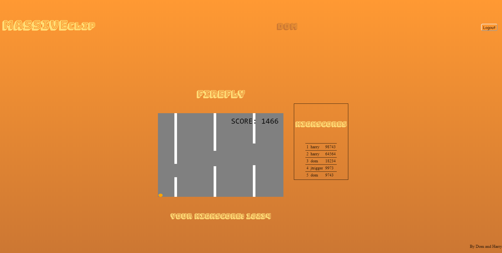
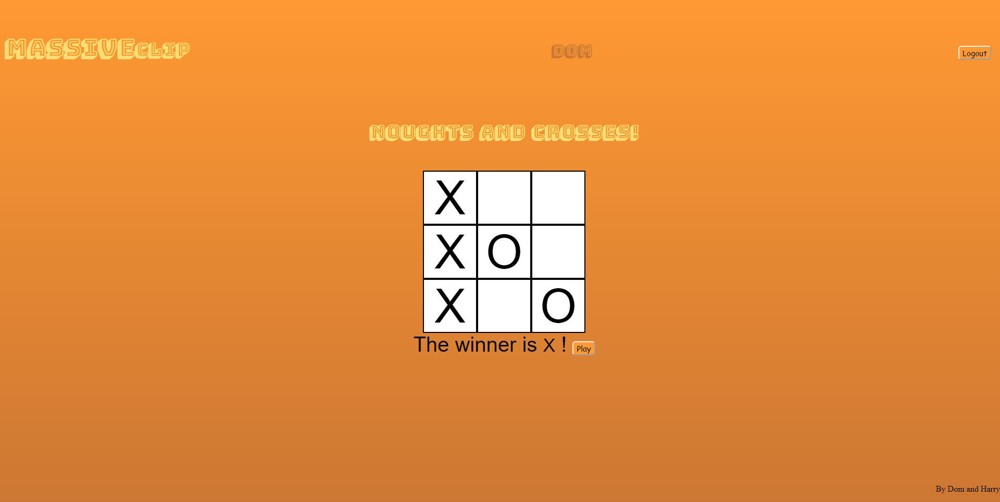

README
======

# OBJECTIVE
To create a platform for online gaming with the following functionality:

- Users should be able to login.
- Users should be able to play single-player games and have their high-scores saved for all to see.
- Users should be able to play multiplayer games against other users in real time.
- Users should be able to chat with other users.

# User Stories
-       As a user,
        I want to be able to enter username and password to log in,
        Therefore I need a form to put my details in.
-       As a user,
        I want to be able to sign up and have my own account,
        Therefore I need a sign-up form.
-       As a user,
        I want to be able to sign out,
        Therefore I want a sign-out button on my homepage.
-       As a user,
        I want to be able to click on game links to select a game to play,
        Therefore my homepage must have links which redirect me to specific games.
-       As a user,
        I want my high-scores to be saved and displayed to other users,
        Therefore the games I play must write my scores to a database.
-       As a user,
        I want to be able to see the top 5 scores for games that I play,
        Therefore game pages must display high scores next to the games themselves.
-       As a user,
        I want to know who I am logged in as,
        Therefore I want my username to be displayed in the headers of each webpage.

# Setup instructions:
- PENDING

# Technologies Used: 
- Tornado
- PostgreSQL
- Heroku

## The website 

  
The homepage  
  
Snake  
  
Snake  
  
Snake  

